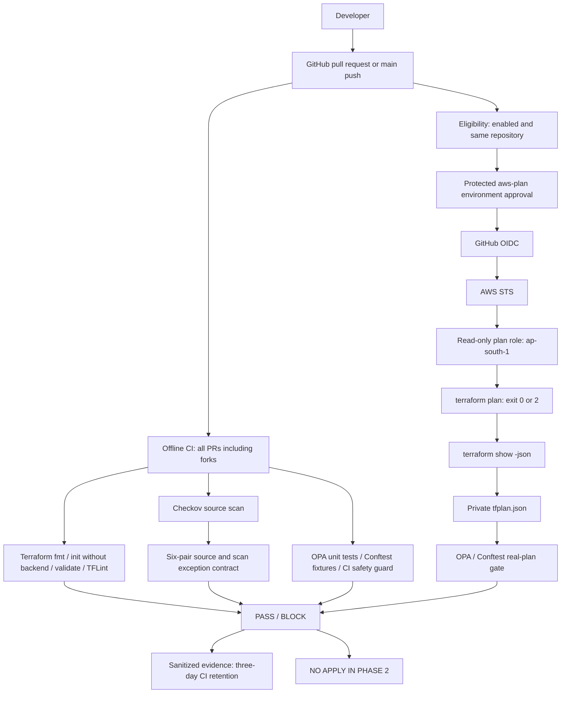
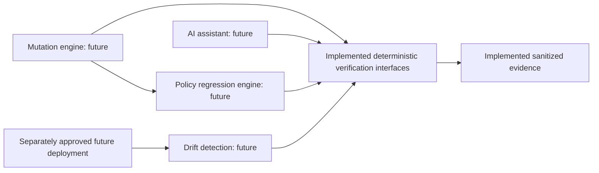

# Phase 2 architecture and research traceability

The authenticated workflow is coded but requires manual AWS/GitHub setup. Forks do not run the plan job. OIDC is only granted to the protected environment. Offline checks need dependency downloads but no AWS authentication. No workload or bootstrap was deployed.

Checkov remains a source gate. Inspection of installed Checkov 3.2.471's `terraform/plan_runner.py` showed ordinary plan resource checks call `registry.scan(..., [], ...)`, without source skip annotations. Deep analysis can enrich a source graph, but consistent preservation of all six exceptions across plan checks has not been established. We therefore do not enable optional Checkov plan scanning or replace source exceptions with global flags. Conftest is the authoritative real-plan policy gate. This is a deliberate scope decision, not a claim that Checkov cannot parse plan JSON.

Policies prefer `resource_changes[].change.after` for changed resources and retain nested `planned_values` for unchanged resources and the original fixtures. Deletions are excluded from the final-state security view; replacements are evaluated against their new state. Security-relevant unknowns block approval. See [policy contract](policies.md).

The existing three Terraform modules remain. Security groups now manage explicit ingress/egress lists so initial plans have known rule sets, with the same disabled-by-default SSH behavior. The policy suite still covers modern standalone rule resources used by fixtures or future configurations. This refactor changes Checkov's observed resource/check counts; those counts are measured, never permanent acceptance criteria.

Small Python modules under `scripts/cloudguard/` separate source inspection, contract verification, scans, planning and evidence. Thin CLI/Bash wrappers and Make targets reuse those operations. The bootstrap is isolated under `bootstrap/aws-plan-role/` and never part of workload planning. Its syntax is validated offline; it is not deployed by CI.

## Future work — NOT IMPLEMENTED

| Research question | Phase 2 preparation | Still required |
|---|---|---|
| RQ1: mutations expose weak/regressed guardrails | Exact exception invariant, negative-control tests, stable plan-policy interface | Mutation corpus/engine, reviewed ground truth and policy comparison experiments |
| RQ2: Checkov vs OPA vs combined detection | Separate source/policy outcomes and real tool versions | Paired experiments on the same Terraform cases; deduplicated measurement definitions |
| RQ3: pre-deployment vs post-deployment drift | Authenticated plan interface, action summaries, evidence provenance | Approved deployment, remote-state design and controlled drift experiments |
| RQ4: verification of AI remediation | Deterministic blocking gates, no deployment permission and sanitized evidence | AI integration and controlled patch-verification experiments with human approval |

No research results have been fabricated. Present test counts describe executed checks, not general security coverage.
